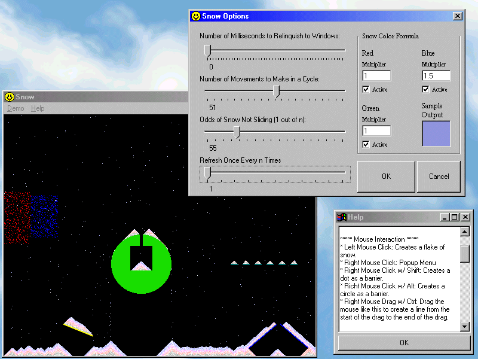



## Natural Snow 1\.0

### Description

This program simulates snowfall in a very realistic way! It has quite a few speed adjustments and has been written for pure speed! I have included many options and around four custom backgrounds. Please vote for my program!
 
### More Info
 

             |
---                |---
**Submitted On**   |2001-03-01 23:42:36
**By**             |[Wesley Crossman](https://github.com/Planet-Source-Code/PSCIndex/blob/master/ByAuthor/wesley-crossman.md)
**Level**          |Intermediate
**User Rating**    |4.5 (18 globes from 4 users)
**Compatibility**  |VB 5\.0, VB 6\.0
**Category**       |[Graphics](https://github.com/Planet-Source-Code/PSCIndex/blob/master/ByCategory/graphics__1-46.md)
**World**          |[Visual Basic](https://github.com/Planet-Source-Code/PSCIndex/blob/master/ByWorld/visual-basic.md)
**Archive File**   |[CODE\_UPLOAD15685322001\.zip](https://github.com/Planet-Source-Code/wesley-crossman-natural-snow-1-0__1-21443/archive/master.zip)

